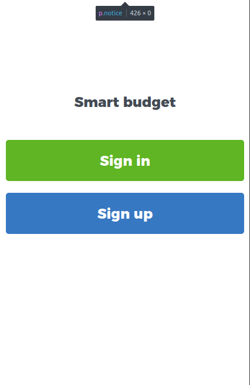
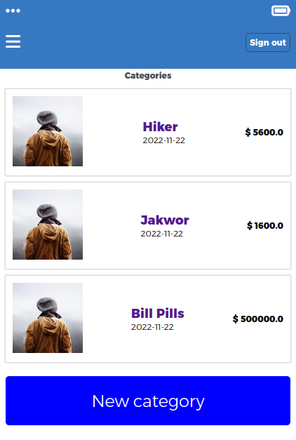
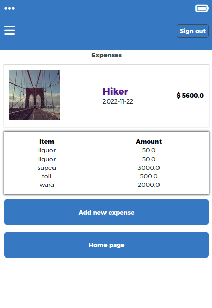
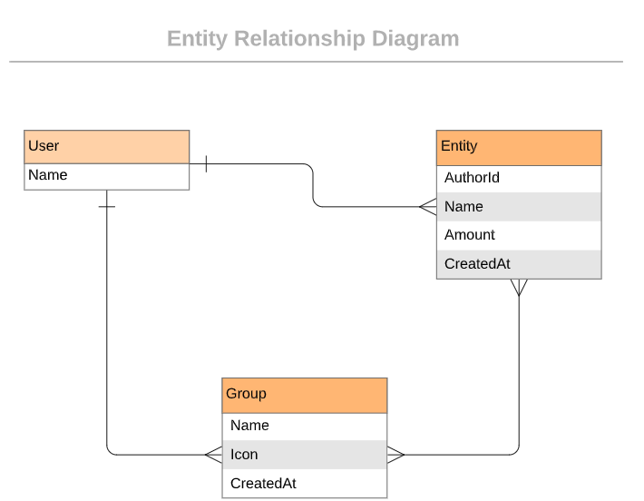

 

# Smart budget

>This application is created using ruby on rails. It follows a [design](https://www.behance.net/gallery/19759151/Snapscan-iOs-design-and-branding?tracking_source=) idea by [Gregoire Vella on Behance](https://www.behance.net/gregoirevella). A signed-up user can sign-in and  create categories and track expenses grouped by categories.

# Quick view

## Built With

- Language: Ruby
- Frameworks: Ruby on Rails
- Testing: 
     - Unit : RSpec
     - Integration : Capybara
- Database : PostgressSQL
- Template engine .erb

## The ERD

## Live Demo
[Live Demo Link](https://rocky-plateau-40125.herokuapp.com/)

## Getting Started

- Install Ruby ( 3.1.2 preffered) and Rails (7.0.4 prefered)
- Run the foollowing commands on your terminal
  - Clone the repository by runiing  `git clone git@github.com:wayungi/budget_app.git`
  - `cd smart_app`
  - Run `bundle install`
  - Run `rails db:create db:migrate`
  - Run `rails s`
- Open Browser `http://localhost:3000/`

## Testing
- Run `rspec`

## Authors

👤 **Francis Wayungi**

- GitHub: [@githubhandle](https://github.com/wayungi)
- Twitter: [@twitterhandle](https://twitter.com/FrancisWayungi)
- LinkedIn: [LinkedIn](https://linkedin.com/in/francis-wayungi-3aa626231)

## 🤝 Contributing

Contributions, issues, and feature requests are welcome!

Feel free to check the [issues page](https://github.com/wayungi/budget_app/issues).

## Show your support

Give a ⭐️ if you like this project!

## Acknowledgments

- Microverse
- Original [design](https://www.behance.net/gallery/19759151/Snapscan-iOs-design-and-branding?tracking_source=) idea by [Gregoire Vella on Behance](https://www.behance.net/gregoirevella)
- [Vannesa Bonito](https://github.com/VaneCode)

## 📝 License

This project is [MIT](./MIT.md) licensed.
